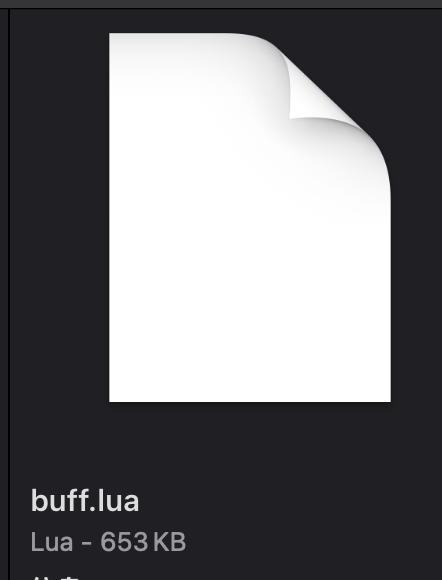
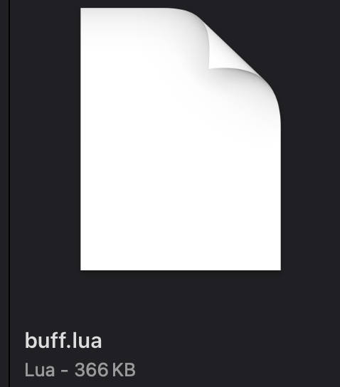
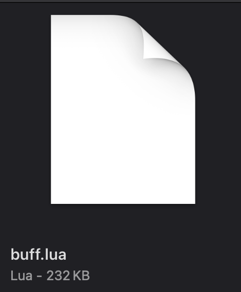

Excel2Lua
=================
目前支持的配表类型有:int,string,float,List<>,Dictionary<>,其中List和Dictionary支持基础类型（int,string,float）
+ Python 版本2.7.16

+ 对导出的lua表的大小做了优化
    - 出现次数最多的值作为默认值
    - 将字段名提取出来减少重复的文本

    - 对比：
        - 最最基础的导出格式
         
        - 使用LuaTableOptimizer
         
        - 目前的导出方式
         

#### HOW TO USE
+ 配置表位置:./xlsx_origin
+ 命令行调用 py ./tolua.py
+ 导出lua文件位置 ./Test